# AI Assistant – Webowa aplikacja wspomagająca testowanie kodu

**AI Assistant** to przeglądarkowa aplikacja wspierająca proces testowania oprogramowania. Wykorzystuje technologię **Google Gemini** do automatycznego generowania testów jednostkowych, analizy bezpieczeństwa kodu oraz oceny zgodności z zasadami **SOLID**. Projekt powstał jako narzędzie wspomagające testerów, programistów i studentów w codziennej pracy z kodem źródłowym.

## Autor

**Jakub Kurek**  
Student Informatyki Akademii Tarnowskiej w Tarnowie, 2025

## Funkcje aplikacji

- Generowanie testów jednostkowych na podstawie kodu źródłowego
- Analiza potencjalnych luk bezpieczeństwa w kodzie
- Weryfikacja zgodności z zasadami SOLID:
  - **SRP** – Single Responsibility Principle
  - **OCP** – Open/Closed Principle
  - **LSP** – Liskov Substitution Principle
  - **ISP** – Interface Segregation Principle
  - **DIP** – Dependency Inversion Principle
- Wsparcie dla plików `.py`, `.js`, `.ts`, `.html`, `.php`, `.txt`, `.java`
- Obsługa przeciągania plików lub bezpośredniego wklejania kodu
- Przejrzysty interfejs z trybem ciemnym i jasnym (zapamiętywanie motywu)

## Wymagania

- Python 3.8+
- Klucz API do Google Gemini (ustaw w `.env` jako `GEMINI_API_KEY`)
- Flask
- google-generativeai

## Struktura projektu

- `app.py` – główny plik backendu z wykorzystaniem Flask i Google Gemini
- `prompts.py` – zestaw predefiniowanych promptów (QA, bezpieczeństwo, SOLID)
- `.env` – plik konfiguracyjny z kluczem API do Gemini (`GEMINI_API_KEY`)
- `templates/`
  - `index.html` – szablon HTML dla głównego interfejsu
- `static/`
  - `style.css` – arkusz stylów (motyw jasny i ciemny)
  - `script.js` – plik JavaScript obsługujący UI i integrację z backendem
- `README.md` – dokumentacja projektu
- `requirements.txt` - lista wymaganych bibliotek Pythona

## Zrzuty ekranu

## Interfejs główny
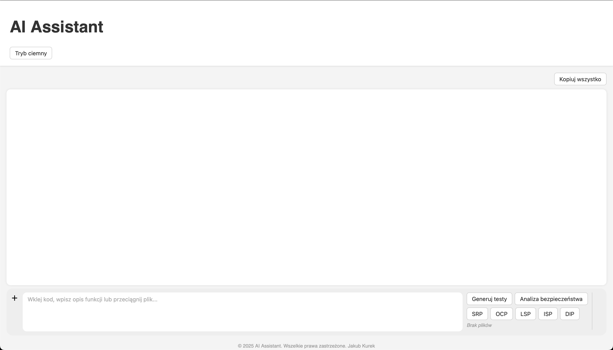
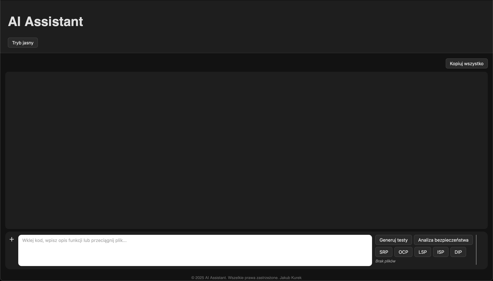

## SRP
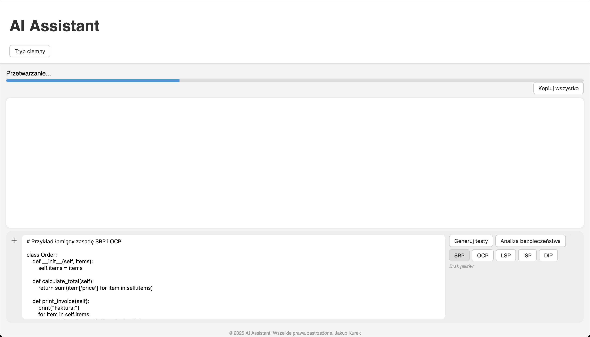
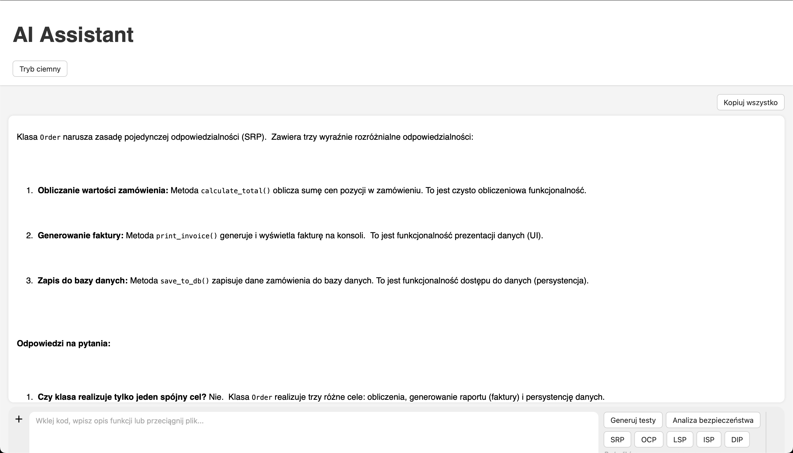
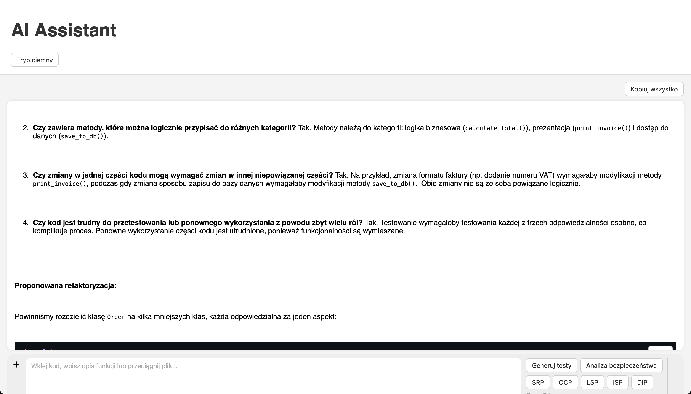
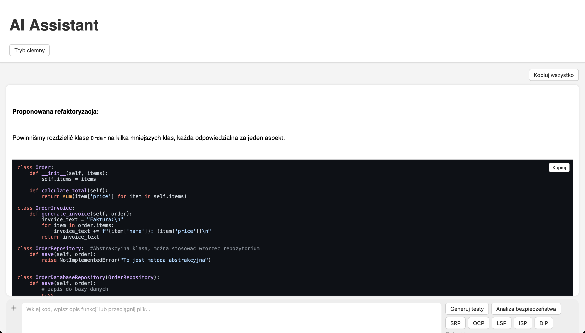
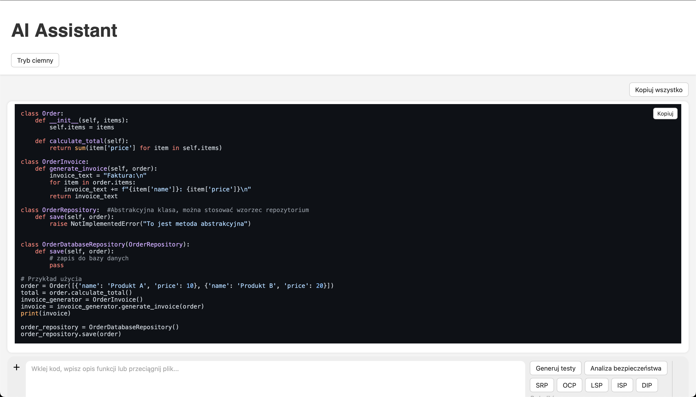
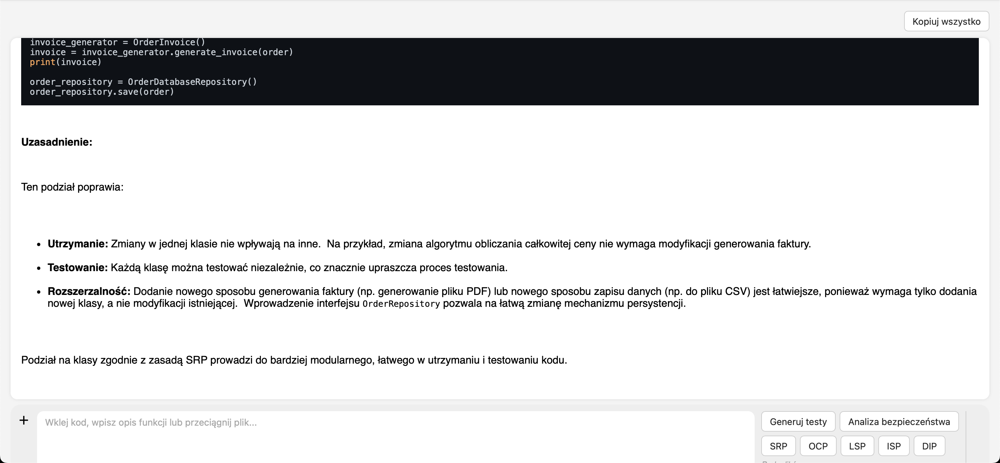

## Generowanie testów
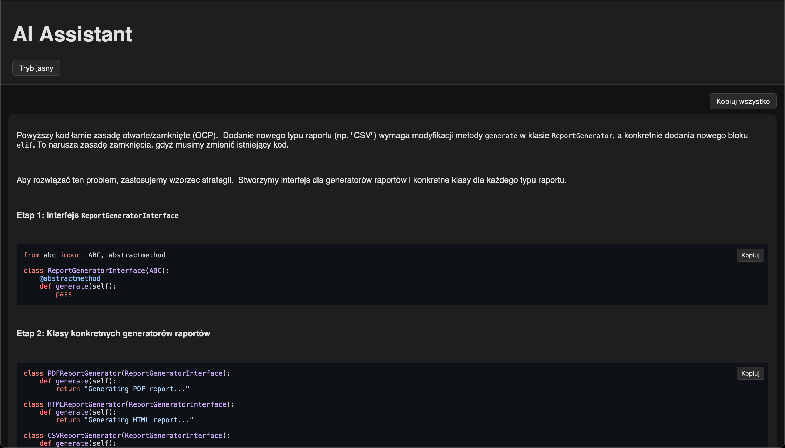
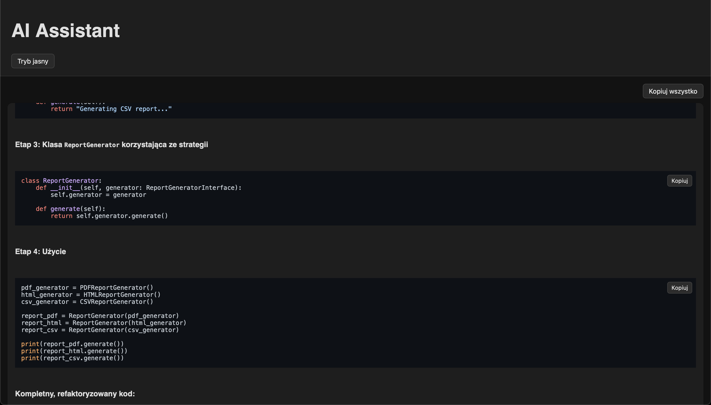
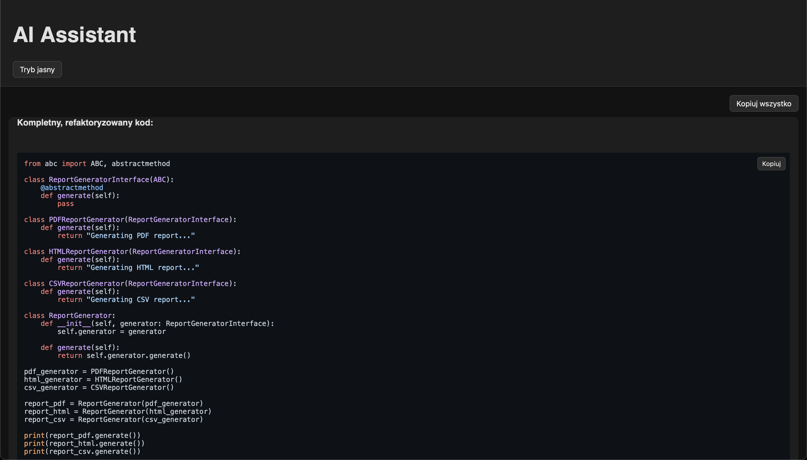
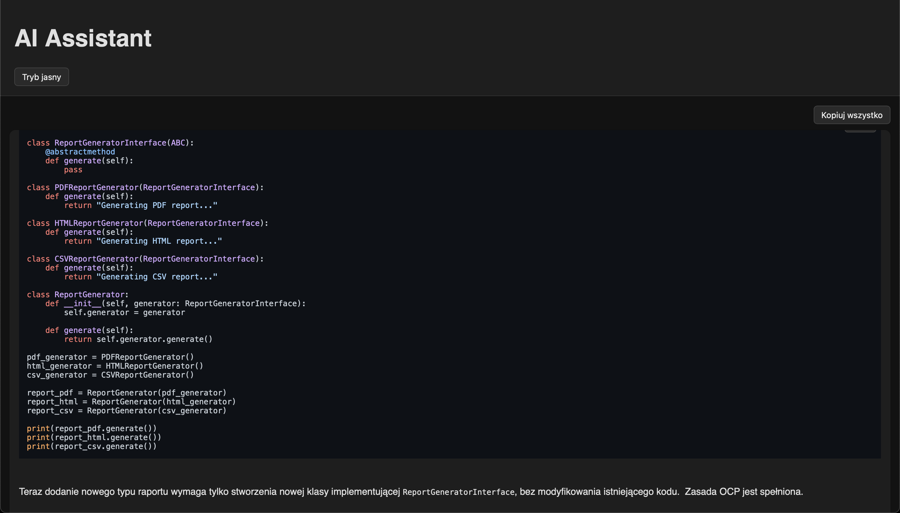

## Nagranie działania aplikacji 
[Zobacz film demo](Demo/AI_Assistant.mp4)